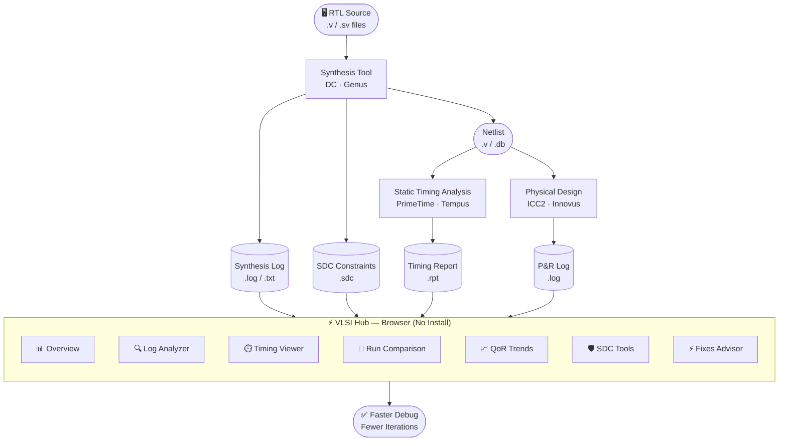
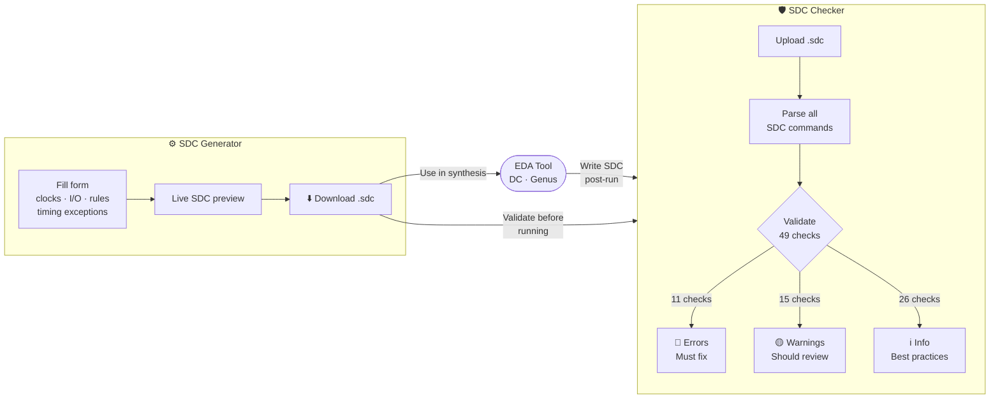

<div align="center">


<br/><br/>

<h1>⚡ VLSI Hub</h1>

<p><strong>Open source EDA intelligence platform for synthesis and layout engineers.</strong></p>

<p>
Parse logs · Analyse timing · Compare runs · Track QoR · Validate SDC constraints<br/>
All in one place. No installation. Runs entirely in the browser.
</p>

<br/>

### 🔗 [vlsi-hub.vercel.app](https://vlsi-hub.vercel.app) — Live Demo

<br/>

</div>

---

## 📋 Table of Contents

- [Overview](#-overview)
- [Tool Workflow](#-tool-workflow)
- [Features](#-features)
- [SDC Tools Flow](#-sdc-tools-flow)
- [Supported EDA Tools](#-supported-eda-tools)
- [Quick Start](#-quick-start)
- [Project Structure](#-project-structure)
- [Technology Stack](#-technology-stack)
- [Deployment](#-deployment)
- [Roadmap](#-roadmap)
- [Contributing](#-contributing)
- [Related Projects](#-related-projects)
- [License](#-license)

---

## 🧭 Overview

VLSI Hub is a browser-based intelligence layer that sits on top of your existing EDA flow. Upload your synthesis logs, timing reports, and SDC files — VLSI Hub parses them, visualises the results, and helps you find and fix issues faster.

**No backend. No login. No data leaves your machine.** All parsing and analysis runs client-side in JavaScript.

---

## 🔄 Tool Workflow

The diagram below shows how VLSI Hub fits into a typical synthesis and signoff flow.



---

## ✨ Features

### 📊 Overview Dashboard

The entry point for every run. Instant health check the moment you upload a log.

| Widget | Description |
|--------|-------------|
| **Stat cards** | Errors, warnings, WNS (ns), violating paths — at a glance |
| **Design stats bar** | Cell count, area (µm²), net count, TNS, elapsed time |
| **Issues by category** | Live bar chart — timing, elaboration, netlist, physical, optimization |
| **QoR trend** | Sparkline showing WNS improvement across your last 5 runs |
| **Clock domain health** | Table — period, WNS, TNS, violations, status per clock domain |
| **Quick nav** | One-click jump to Log Analyzer or Timing Viewer |

---

### 🔍 Log Analyzer

Deep-dive into synthesis and P&R logs. Tool is auto-detected from log content.

**Key capabilities:**

- **Drag-and-drop upload** — `.log` or `.txt` files
- **Auto tool detection** — identifies DC, Genus, PrimeTime, ICC2, or Innovus from log headers
- **Group by code** — collapses `OPT-110 ×15` into a single expandable row
- **Severity filters** — Error / Warning / Info
- **Category filters** — timing, elaboration, netlist, physical, optimization, clock
- **Full-text search** — across messages and error codes
- **Fix hints** — expand any entry for a specific remediation step
- **CSV export** — download filtered results for team review

**Supported error codes with fix hints:**

| Code | Issue |
|------|-------|
| `ELAB-302` | Cell reference not found |
| `OPT-001` | Setup timing constraint not met |
| `OPT-110` | High fanout net |
| `TIM-104` | Hold violation |
| `UID-95` | Undriven net |
| `GEN-001` | Unresolved module |
| `GEN-042` | Latch inferred |
| `DRC-001` | DRC failure |
| `ROUTE-01` | Unrouted nets |

---

### ⏱ Timing Viewer

Upload PrimeTime or Tempus `.rpt` files and get an interactive timing analysis dashboard.

- **Summary cards** — WNS · TNS · Violating paths count
- **Slack histogram** — distribution of all path slacks across buckets (red = violated, green = met)
- **Clock domain chart** — WNS per clock domain, colour-coded by status
- **Critical paths table** — sortable, filterable (All / Violated / Met), click any row for full detail panel
- **CSV export** — export filtered paths for timing review meetings

---

### 🔀 Run Comparison

Compare any two synthesis runs side by side to understand exactly what changed.

```
Run A (baseline)    →    Run B (optimised)
──────────────────────────────────────────
Errors:   5         →    0       ✅  -5
Warnings: 7         →    3       ✅  -4
WNS:   -1.231 ns    →  -0.287 ns ✅  +0.944 ns
TNS:   -9.823 ns    →  -1.840 ns ✅  +7.983 ns
```

- Upload unlimited runs, select any two as **A** and **B**
- Delta cards — errors, warnings, WNS, TNS
- **Per-category breakdown** — timing: 3→0 ✅, elaboration: 1→2 🔴
- **Design stats delta** — cell count, area side-by-side
- **Diff tabs** — 🔴 New in B · ✅ Fixed · ⚠️ Remaining
- **Verdict banner** — automatic pass/fail/mixed summary

---

### 📈 QoR Trends

Track quality across your entire synthesis campaign. Spot regressions before tapeout.

- **Metric selector** — WNS · TNS · Errors · Warnings · NVP · Cells · Area
- **Area chart** — with coloured dots per run
- **Regression threshold** — set a WNS target; runs below it highlighted red automatically
- **4-chart mini grid** — errors, WNS, warnings, cells all in one view
- **Runs table** — sortable by name, errors, WNS; click any row for full run detail

---

### 🛡 SDC Tools

A complete SDC constraint workflow — **Checker** and **Generator** — integrated into the same interface.

#### Checker — 49 total checks

| Severity | Count | Example checks |
|----------|-------|---------------|
| 🔴 Error | 11 | No `create_clock`, missing `-source`, input delay ≥ period, virtual clock with `set_propagated_clock` |
| 🟡 Warning | 15 | Missing `-hold` on multicycle path, no `set_propagated_clock`, CDC without `set_clock_groups`, unbalanced timing derate |
| ℹ️ Info | 26 | No `set_max_transition`, no `set_timing_derate`, no `set_clock_jitter`, missing `set_units` |

#### Generator — full constraint coverage

Generates complete SDC with live preview and direct `.sdc` download:

`create_clock` · `create_generated_clock` (all switches: `-divide_by` `-multiply_by` `-duty_cycle` `-invert` `-preinvert` `-combinational` `-add`) · virtual clocks · `set_clock_uncertainty` (setup + hold auto) · `set_clock_latency` · `set_propagated_clock` · `set_clock_transition` · `set_clock_jitter` · `set_clock_gating_check` · `set_input_delay` (-max/-min) · `set_output_delay` (-max/-min) · `set_driving_cell` · `set_input_transition` · `set_load` · `set_max_fanout` · `set_max_transition` · `set_max_capacitance` · `set_operating_conditions` · `set_timing_derate` (AOCV) · `set_ideal_network` · `set_case_analysis` (multiple entries, 0/1/rising/falling) · `set_disable_timing` (per arc) · `set_min_pulse_width` · half-cycle paths (`-rise_to`/`-fall_to`) · `group_path` · `set_wire_load_mode/model` · power constraints · `set_dont_use`

---

### ⚡ Fixes Advisor

Aggregates all fixable issues from the uploaded log with occurrence counts (`OPT-110 ×15`) and specific remediation steps for each. Also includes 6 general synthesis best-practice cards.

---

## 🔄 SDC Tools Flow



---

## 🛠 Supported EDA Tools

| Tool | Vendor | Log Parsing | Timing Report |
|------|--------|------------|---------------|
| Design Compiler (DC) | Synopsys | ✅ | — |
| PrimeTime (PT) | Synopsys | ✅ | ✅ `.rpt` |
| IC Compiler II (ICC2) | Synopsys | ✅ | — |
| Genus | Cadence | ✅ | — |
| Tempus | Cadence | ✅ | ✅ `.rpt` |
| Innovus | Cadence | ✅ | — |

---

## 🚀 Quick Start

### Prerequisites

- [Node.js](https://nodejs.org) v18+
- npm v9+

### Run locally

```bash
# 1. Clone
git clone https://github.com/RAMA-L7/vlsi-hub.git
cd vlsi-hub

# 2. Install
npm install

# 3. Start
npm run dev
```

Open **http://localhost:5173** — no backend, no API keys, no environment variables needed.

### Build for production

```bash
npm run build
# Output → dist/  (host anywhere)
```

---

## 📁 Project Structure

```
vlsi-hub/
│
├── src/
│   ├── main.jsx              ← React entry point
│   └── App.jsx               ← Full application
│       │
│       ├── Design tokens      C, TOOL_LABEL, RUN_COLORS
│       ├── Shared UI          Card, Badge, StatCard, SectionTitle,
│       │                      CopyBtn, ActionBtn, DropZone, RunBanner,
│       │                      PageHeader, EmptyState
│       │
│       ├── SDC helpers        Inp, Chk, Sel, FField, ColSec,
│       │                      InfoBox, sdcDownload
│       │
│       ├── Parsers
│       │   ├── parseLogText   DC/Genus/PT/ICC2/Innovus log parser
│       │   ├── parseTimingRpt PrimeTime/Tempus .rpt parser
│       │   └── parseSDC       SDC constraint validator
│       │
│       ├── Pages
│       │   ├── OverviewPage
│       │   ├── LogAnalyzerPage
│       │   ├── TimingViewerPage
│       │   ├── RunComparisonPage
│       │   ├── QoRTrendPage
│       │   ├── SDCToolsPage
│       │   │   ├── SDCCheckerPage
│       │   │   └── SDCGeneratorPage
│       │   └── FixesAdvisorPage
│       │
│       ├── Sidebar            Navigation + version + tool list
│       └── App                Root component + state management
│
├── public/
├── index.html
├── vite.config.js
├── package.json
├── LICENSE
└── README.md
```

---

## 🏗 Technology Stack

| Layer | Technology | Why |
|-------|-----------|-----|
| UI Framework | React 18 | Component-based, fast re-renders |
| Build Tool | Vite 5 | Instant HMR, fast production builds |
| Charts | Recharts 2 | Composable, responsive charts |
| Icons | Lucide React | Consistent, lightweight icon set |
| Parsing | Vanilla JS (regex) | Zero-dependency, runs in browser |
| Hosting | Vercel | Free, global CDN, auto-deploy from GitHub |

> **No backend** — the entire application is a static site. All log parsing, timing analysis, and SDC validation runs as JavaScript in the browser. Your files never leave your machine.

---

## 🌐 Deployment

### Vercel (recommended — free)

[](https://vercel.com/new/clone?repository-url=https://github.com/RAMA-L7/vlsi-hub)

1. Click the button above
2. Sign in with GitHub
3. Leave all settings as default
4. Click **Deploy** — live in ~60 seconds

Every `git push` to `main` auto-deploys.

### Other options

```bash
# Netlify, GitHub Pages, or any static host
npm run build
# Serve the dist/ folder
```

---

## 🗺 Roadmap

| Feature | Status |
|---------|--------|
| Log Analyzer — auto tool detection | ✅ Done |
| Timing Viewer — slack histogram | ✅ Done |
| Run Comparison — per-category diff | ✅ Done |
| QoR Trends — regression threshold alerts | ✅ Done |
| SDC Checker — 49 validation checks | ✅ Done |
| SDC Generator — full constraint coverage | ✅ Done |
| Half-cycle path constraints | ✅ Done |
| Virtual clock support | ✅ Done |
| **AI "Ask Your Run"** — chat with your log | 🔜 Next |
| Regression alerts — Slack / email | 🔜 Planned |
| CLI uploader — `vlsi-hub upload ./logs/` | 🔜 Planned |
| FastAPI backend — persistent run storage | 🔜 Planned |
| Multi-user team projects | 🔜 Planned |

---

## 🤝 Contributing

Contributions are welcome!

1. Fork the repo
2. Create a feature branch — `git checkout -b feature/my-feature`
3. Commit — `git commit -m "Add: my feature"`
4. Push — `git push origin feature/my-feature`
5. Open a Pull Request

For major changes, please open an issue first to discuss the approach.

---

## 🔗 Related Projects

| Project | Description | Links |
|---------|-------------|-------|
| **SDC Tools** | Standalone Python/Streamlit app for SDC validation and generation | [GitHub](https://github.com/RAMA-L7/sdc-tools) · [Live Demo](https://sdc-tools-8mxtuhwy5myvejdcmpuwbp.streamlit.app) |

---

## 📄 License

MIT © [RAMA-L7](https://github.com/RAMA-L7)

---

<div align="center">

Built for synthesis engineers, by a synthesis engineer.

⭐ **Star this repo if you find it useful**

</div>
